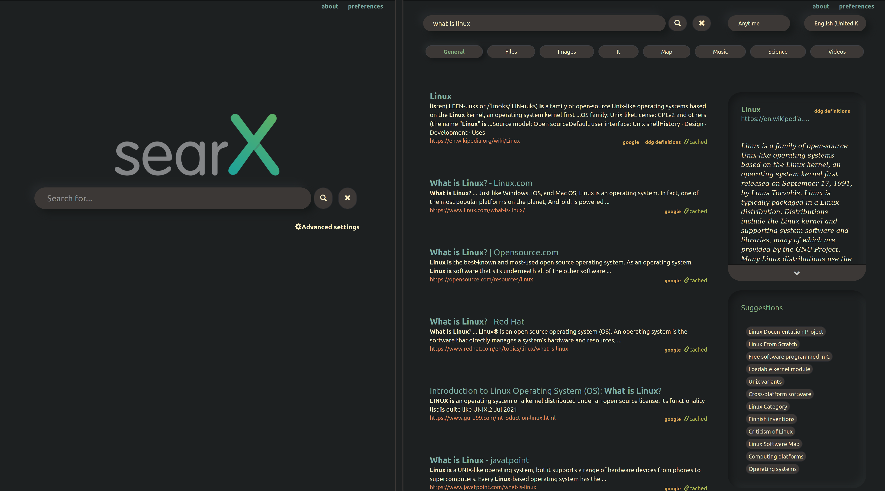

## Neomorphism is a modern design language with an element of depth and shadow.
These themes can be applied using the **Stylus** extension for Firefox and Chromium-based browsers. Colours can easily be modified by changing the root variables at the top of each CSS theme. Example screenshots use .
---
# Element

# GitHub

# SearX

 | 
